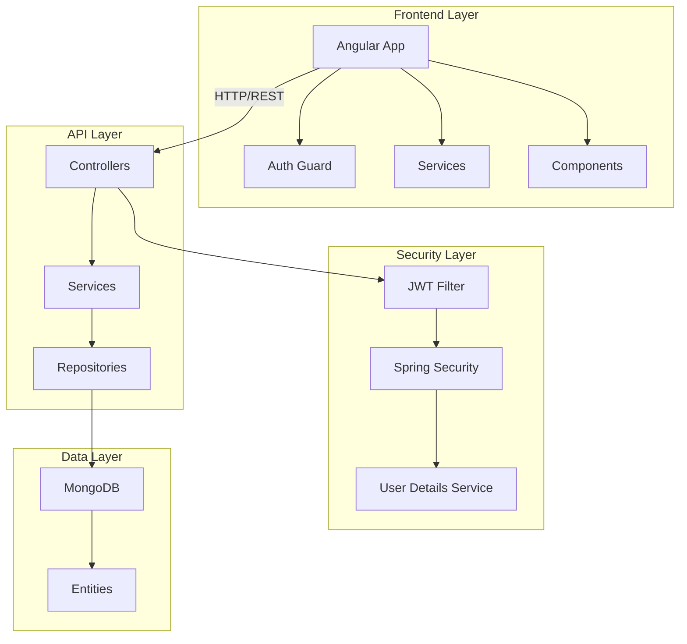

# Design Document - EGA Bank

## Overview

EGA Bank est un système de gestion bancaire moderne composé d'une API REST Spring Boot sécurisée et d'une application frontend Angular. Le système utilise MongoDB comme base de données NoSQL et implémente une authentification JWT avec Spring Security. L'architecture suit les principes de Clean Architecture avec une séparation claire entre les couches de présentation, métier et données.

## Architecture

### Architecture Globale

Le système EGA Bank suit une architecture en couches avec séparation claire des responsabilités :



### Architecture Backend (Spring Boot)

**Couche Contrôleur** :
- `AuthController` : Gestion de l'authentification (login, register, init-admin)
- `ClientController` : CRUD des clients
- `CompteController` : CRUD des comptes bancaires
- `TransactionController` : Opérations bancaires et historique

**Couche Service** :
- `AuthService` : Logique d'authentification et gestion JWT
- `ClientService` : Logique métier des clients
- `CompteService` : Logique métier des comptes
- `TransactionService` : Logique métier des transactions

**Couche Repository** :
- `UserRepository` : Accès aux données utilisateurs
- `ClientRepository` : Accès aux données clients
- `CompteRepository` : Accès aux données comptes
- `TransactionRepository` : Accès aux données transactions

### Architecture Frontend (Angular)

**Composants** :
- `LoginComponent` : Authentification utilisateur
- `RegisterComponent` : Inscription utilisateur
- `DashboardComponent` : Tableau de bord administrateur
- `ProfilComponent` : Profil client et gestion des comptes

**Services** :
- `AuthService` : Gestion de l'authentification côté client
- `ClientService` : Communication API pour les clients
- `CompteService` : Communication API pour les comptes
- `TransactionService` : Communication API pour les transactions
- `DataCacheService` : Cache des données pour optimiser les performances

**Guards** :
- `AuthGuard` : Protection des routes nécessitant une authentification

## Components and Interfaces

### Entités Backend

**User Entity** :
```java
@Document(collection = "users")
public class User {
    @Id
    private String id;
    private String username;
    private String password; // BCrypt hashed
    private Role role; // ROLE_ADMIN, ROLE_CLIENT
    private Client client; // Reference to client for ROLE_CLIENT
}
```

**Client Entity** :
```java
@Document(collection = "clients")
public class Client {
    @Id
    private String id;
    private String nom;
    private String prenom;
    private LocalDate dateNaissance;
    private String sexe;
    private String adresse;
    private String telephone;
    private String courriel; // Unique
    private String nationalite;
}
```

**Compte Entity** :
```java
@Document(collection = "comptes")
public class Compte {
    @Id
    private String id;
    private String numeroCompte; // IBAN format
    private TypeCompte typeCompte; // COURANT, EPARGNE
    private BigDecimal solde; // Initial = 0.0
    private LocalDateTime dateCreation;
    private String clientId; // Reference to client
}
```

**Transaction Entity** :
```java
@Document(collection = "transactions")
public class Transaction {
    @Id
    private String id;
    private TypeTransaction typeTransaction; // DEPOT, RETRAIT, VIREMENT
    private BigDecimal montant;
    private LocalDateTime dateTransaction;
    private String compteId; // Source account
    private String compteDestinataireId; // For transfers
    private String description;
    private BigDecimal soldeApres; // Balance after transaction
}
```

### DTOs et Requests

**AuthRequest** :
```java
public class AuthRequest {
    @NotBlank
    private String username;
    @NotBlank
    private String password;
}
```

**OperationRequest** :
```java
public class OperationRequest {
    @NotBlank
    private String numeroCompte;
    @NotNull
    @DecimalMin("0.01")
    private BigDecimal montant;
    private String description;
}
```

**VirementRequest** :
```java
public class VirementRequest {
    @NotBlank
    private String compteSource;
    @NotBlank
    private String compteDestinataire;
    @NotNull
    @DecimalMin("0.01")
    private BigDecimal montant;
    private String description;
}
```

### Interfaces Frontend

**AuthService Interface** :
```typescript
interface AuthService {
  login(credentials: AuthRequest): Observable<AuthResponse>;
  register(request: RegisterRequest): Observable<AuthResponse>;
  logout(): void;
  isAuthenticated(): boolean;
  getCurrentUser(): User | null;
  getToken(): string | null;
}
```

**Transaction Interface** :
```typescript
interface Transaction {
  id: string;
  typeTransaction: 'DEPOT' | 'RETRAIT' | 'VIREMENT';
  montant: number;
  dateTransaction: string;
  compteNumero: string;
  compteDestinataireNumero?: string;
  description: string;
  soldeApres: number;
}
```

## Data Models

### Base de Données MongoDB

**Collections** :
- `users` : Utilisateurs du système (admin et clients)
- `clients` : Informations personnelles des clients
- `comptes` : Comptes bancaires
- `transactions` : Historique des opérations

**Relations** :
- Un `User` peut avoir un `Client` associé (pour ROLE_CLIENT)
- Un `Client` peut avoir plusieurs `Compte`
- Un `Compte` appartient à un seul `Client`
- Une `Transaction` est liée à un `Compte` source et optionnellement un `Compte` destinataire

### Contraintes de Données

**Validation** :
- Email client unique dans le système
- Numéro de compte unique (format IBAN)
- Montants des transactions positifs
- Solde suffisant pour retraits et virements
- Mots de passe hashés avec BCrypt

**Règles Métier** :
- Solde initial des comptes = 0.0
- Deux types de comptes : COURANT et EPARGNE
- Transactions atomiques pour les virements
- Historique complet des transactions conservé

## Correctness Properties

*A property is a characteristic or behavior that should hold true across all valid executions of a system-essentially, a formal statement about what the system should do. Properties serve as the bridge between human-readable specifications and machine-verifiable correctness guarantees.*

Basé sur l'analyse prework des critères d'acceptation, voici les propriétés de correctness pour EGA Bank :

### Client Management Properties

**Property 1: Client CRUD Operations**
*For any* valid client data, all CRUD operations (create, read, update, delete) should work correctly and maintain data integrity
**Validates: Requirements 1.1**

**Property 2: Client Field Validation**
*For any* client creation request, all required fields (nom, prénom, date de naissance, sexe, adresse, téléphone, courriel, nationalité) must be validated and invalid requests rejected
**Validates: Requirements 1.2**

**Property 3: Email Format Validation**
*For any* email address provided during client creation or update, the system should validate the email format and reject invalid formats
**Validates: Requirements 1.3**

**Property 4: Phone Format Validation**
*For any* phone number provided during client creation or update, the system should validate the phone format according to defined rules
**Validates: Requirements 1.4**

**Property 5: Email Uniqueness Constraint**
*For any* two clients, their email addresses must be unique across the entire system
**Validates: Requirements 1.5**

### Account Management Properties

**Property 6: Account CRUD Operations**
*For any* valid account data, all CRUD operations should work correctly and maintain referential integrity with clients
**Validates: Requirements 2.1**

**Property 7: IBAN Generation and Uniqueness**
*For any* newly created account, the system should generate a unique IBAN format account number that is valid and not already in use
**Validates: Requirements 2.2, 2.6**

**Property 8: Initial Balance Zero**
*For any* newly created account, the initial balance should always be set to exactly zero
**Validates: Requirements 2.3**

**Property 9: Account Type Validation**
*For any* account creation request, only the two supported account types (COURANT and EPARGNE) should be accepted
**Validates: Requirements 2.4**

**Property 10: Client Association Validation**
*For any* account creation request, the account can only be created if it references an existing client
**Validates: Requirements 2.5**

**Property 11: Account Response Completeness**
*For any* account retrieval operation, the response should include complete associated client information
**Validates: Requirements 2.7**

### Transaction Properties

**Property 12: Transaction Amount Validation**
*For any* banking operation (deposit, withdrawal, transfer), the amount must be positive and greater than zero
**Validates: Requirements 3.1, 4.1**

**Property 13: Deposit Balance Update**
*For any* valid deposit operation, the account balance should increase by exactly the deposit amount
**Validates: Requirements 3.2**

**Property 14: Withdrawal Balance Validation**
*For any* withdrawal request, the operation should only succeed if the account balance is greater than or equal to the withdrawal amount
**Validates: Requirements 4.2**

**Property 15: Withdrawal Balance Update**
*For any* valid withdrawal operation, the account balance should decrease by exactly the withdrawal amount
**Validates: Requirements 4.4**

**Property 16: Insufficient Balance Error Handling**
*For any* withdrawal or transfer request where the source account has insufficient balance, the system should reject the operation and return an appropriate error message
**Validates: Requirements 4.3, 5.3**

**Property 17: Transfer Account Validation**
*For any* transfer request, both source and destination accounts must exist in the system
**Validates: Requirements 5.1**

**Property 18: Transfer Balance Conservation**
*For any* valid transfer operation, the total amount of money in the system should remain constant (source account decreases by X, destination account increases by X)
**Validates: Requirements 5.4**

**Property 19: Self-Transfer Prevention**
*For any* transfer request, the system should reject transfers where the source and destination accounts are the same
**Validates: Requirements 5.7**

**Property 20: Transaction Record Creation**
*For any* completed banking operation (deposit, withdrawal, transfer), the system should create appropriate transaction records with correct type and details
**Validates: Requirements 3.3, 4.5, 5.5**

**Property 21: Transaction Timestamp Recording**
*For any* transaction, the system should record an accurate timestamp reflecting when the operation was processed
**Validates: Requirements 3.4**

### Transaction History Properties

**Property 22: Transaction History Retrieval**
*For any* account, the system should provide endpoints to retrieve complete transaction history for that account
**Validates: Requirements 6.1**

**Property 23: Date Range Filtering**
*For any* transaction history request with date range parameters, only transactions within the specified range should be returned
**Validates: Requirements 6.2**

**Property 24: Default Date Range**
*For any* transaction history request without date parameters, the system should return transactions from the last 30 days by default
**Validates: Requirements 6.3**

**Property 25: Transaction Ordering**
*For any* transaction history response, results should be ordered by date with the most recent transactions first
**Validates: Requirements 6.4**

**Property 26: Transaction Data Completeness**
*For any* transaction in the history response, all required details (amount, type, date, involved accounts) should be included
**Validates: Requirements 6.5**

### Statement Generation Properties

**Property 27: Statement Data Completeness**
*For any* generated bank statement, it should include complete client information, account details, and transaction history for the specified period
**Validates: Requirements 7.2**

**Property 28: Statement Date Range Support**
*For any* statement generation request, the system should support custom date ranges and include only transactions within that range
**Validates: Requirements 7.3**

**Property 29: Statement Balance Calculation**
*For any* generated statement, it should accurately calculate and display account balance at the beginning and end of the specified period
**Validates: Requirements 7.5**

### Authentication and Security Properties

**Property 30: JWT Token Generation**
*For any* valid login credentials, the system should generate a valid JWT token containing appropriate user information and roles
**Validates: Requirements 8.1, 8.2**

**Property 31: JWT Token Validation**
*For any* request to protected endpoints, the system should validate the JWT token and allow access only for valid, non-expired tokens
**Validates: Requirements 8.3**

**Property 32: Invalid Token Rejection**
*For any* request with an invalid or expired JWT token, the system should return an authentication error and deny access
**Validates: Requirements 8.4**

**Property 33: Role-Based Access Control**
*For any* authenticated user, the system should enforce role-based access control allowing only appropriate operations based on ADMIN or CLIENT roles
**Validates: Requirements 8.5**

**Property 34: Token Expiration Handling**
*For any* expired JWT token, the system should require re-authentication before allowing access to protected resources
**Validates: Requirements 8.6**

**Property 35: Password Security**
*For any* stored user password, it should be properly hashed and salted using BCrypt before storage
**Validates: Requirements 8.7**

### Error Handling Properties

**Property 36: Global Exception Handling**
*For any* API endpoint, errors should be handled consistently through global exception handling with appropriate HTTP status codes
**Validates: Requirements 9.1, 9.3**

**Property 37: Validation Error Messages**
*For any* validation error, the system should return descriptive error messages that help users understand what went wrong
**Validates: Requirements 9.2**

**Property 38: Input Validation**
*For any* API request, input data should be validated using Jakarta Validation annotations and invalid data rejected
**Validates: Requirements 9.4**

**Property 39: Database Error Handling**
*For any* database error, the system should handle it gracefully and return user-friendly error messages without exposing internal details
**Validates: Requirements 9.5**

**Property 40: Error Logging**
*For any* error that occurs in the system, it should be properly logged with sufficient detail for debugging and monitoring
**Validates: Requirements 9.6**

<function_calls>
<invoke name="prework">
<parameter name="featureName">ega-bank

## Error Handling

### Global Exception Handling

Le système implémente une gestion d'erreurs centralisée via `@ControllerAdvice` pour assurer une cohérence dans les réponses d'erreur :

**Types d'Erreurs Gérées** :
- `ValidationException` : Erreurs de validation des données (HTTP 400)
- `EntityNotFoundException` : Ressources non trouvées (HTTP 404)
- `BusinessRuleException` : Violations des règles métier (HTTP 422)
- `AuthenticationException` : Erreurs d'authentification (HTTP 401)
- `AuthorizationException` : Erreurs d'autorisation (HTTP 403)
- `DatabaseException` : Erreurs de base de données (HTTP 500)

**Format de Réponse d'Erreur** :
```json
{
  "timestamp": "2024-01-15T10:30:00Z",
  "status": 400,
  "error": "Bad Request",
  "message": "Le montant doit être positif",
  "path": "/api/transactions/depot"
}
```

### Validation des Données

**Validation Backend** :
- Utilisation des annotations Jakarta Validation (`@NotNull`, `@NotBlank`, `@DecimalMin`, etc.)
- Validation personnalisée pour les règles métier complexes
- Messages d'erreur localisés en français

**Validation Frontend** :
- Validation côté client avec Angular Reactive Forms
- Validation en temps réel avec feedback visuel
- Messages d'erreur cohérents avec le backend

### Gestion des Erreurs Spécifiques

**Erreurs Bancaires** :
- Solde insuffisant : Message clair avec solde actuel
- Compte inexistant : Vérification avant opération
- Montant invalide : Validation des montants positifs

**Erreurs d'Authentification** :
- Token expiré : Redirection automatique vers login
- Credentials invalides : Message d'erreur sécurisé
- Accès non autorisé : Redirection appropriée selon le rôle

## Testing Strategy

### Approche de Test Dual

Le système EGA Bank utilise une approche de test complémentaire combinant :

**Tests Unitaires** :
- Tests spécifiques pour les cas d'usage concrets
- Tests des cas limites et conditions d'erreur
- Tests d'intégration entre les composants
- Couverture des scénarios métier critiques

**Tests Basés sur les Propriétés (Property-Based Testing)** :
- Validation des propriétés universelles sur de nombreuses entrées générées
- Tests de robustesse avec données aléatoires
- Vérification des invariants métier
- Détection de cas limites non prévus

### Configuration des Tests Basés sur les Propriétés

**Framework Recommandé** : JUnit 5 avec jqwik pour Java
- Minimum 100 itérations par test de propriété
- Génération de données aléatoires mais reproductibles
- Shrinking automatique pour identifier les cas d'échec minimaux

**Format de Tag pour les Tests** :
```java
@Property
@Tag("Feature: ega-bank, Property 1: Client CRUD Operations")
void testClientCrudOperations(@ForAll Client client) {
    // Test implementation
}
```

### Tests par Couche

**Couche Service** :
- Tests unitaires pour la logique métier
- Tests de propriétés pour les invariants
- Mocking des repositories pour l'isolation

**Couche Controller** :
- Tests d'intégration avec MockMvc
- Tests de sérialisation/désérialisation JSON
- Tests des codes de statut HTTP

**Couche Repository** :
- Tests avec base de données embarquée (Testcontainers MongoDB)
- Tests des requêtes personnalisées
- Tests des contraintes de données

**Frontend Angular** :
- Tests unitaires des composants avec Jasmine/Karma
- Tests d'intégration avec TestBed
- Tests end-to-end avec Cypress

### Tests de Sécurité

**Authentification JWT** :
- Tests de génération et validation des tokens
- Tests d'expiration des tokens
- Tests des rôles et autorisations

**Validation des Données** :
- Tests d'injection SQL (même si MongoDB)
- Tests de validation des entrées
- Tests des contraintes de sécurité

### Tests de Performance

**Tests de Charge** :
- Tests avec JMeter pour les endpoints critiques
- Tests de pagination avec grandes quantités de données
- Tests de concurrence pour les opérations bancaires

**Tests de Cache** :
- Validation du cache frontend (DataCacheService)
- Tests de rafraîchissement automatique
- Tests de cohérence des données

### Couverture de Tests

**Objectifs de Couverture** :
- Code coverage : minimum 80%
- Branch coverage : minimum 75%
- Couverture des propriétés : 100% des propriétés critiques testées

**Propriétés Critiques à Tester en Priorité** :
1. Conservation de l'argent dans les virements (Property 18)
2. Validation des soldes suffisants (Property 14, 16)
3. Unicité des comptes et emails (Property 5, 7)
4. Sécurité des mots de passe (Property 35)
5. Validation des montants (Property 12)

### Environnements de Test

**Test Unitaire** :
- Base de données en mémoire (Embedded MongoDB)
- Mocking des services externes
- Isolation complète des tests

**Test d'Intégration** :
- Testcontainers pour MongoDB réel
- Serveur de test Spring Boot
- Tests end-to-end avec données réelles

**Test de Performance** :
- Environnement dédié avec données de volume
- Monitoring des métriques de performance
- Tests de montée en charge progressive