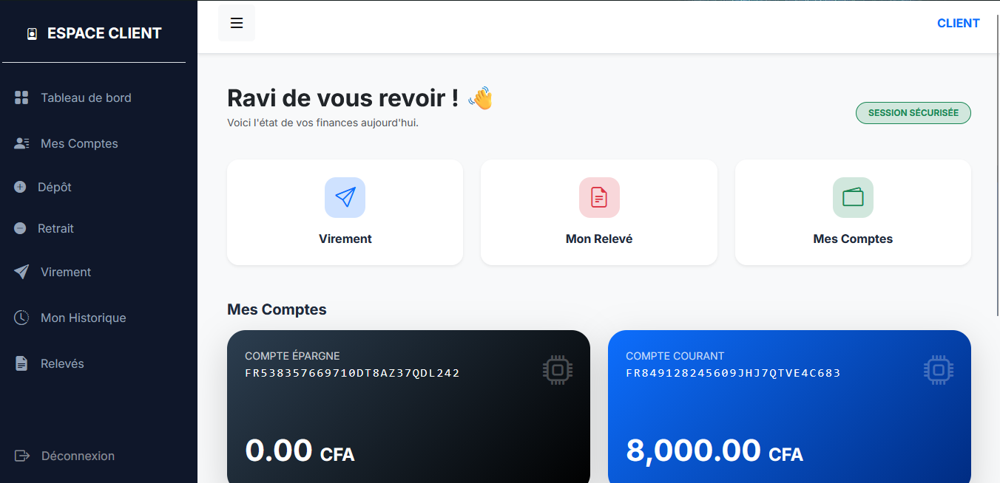
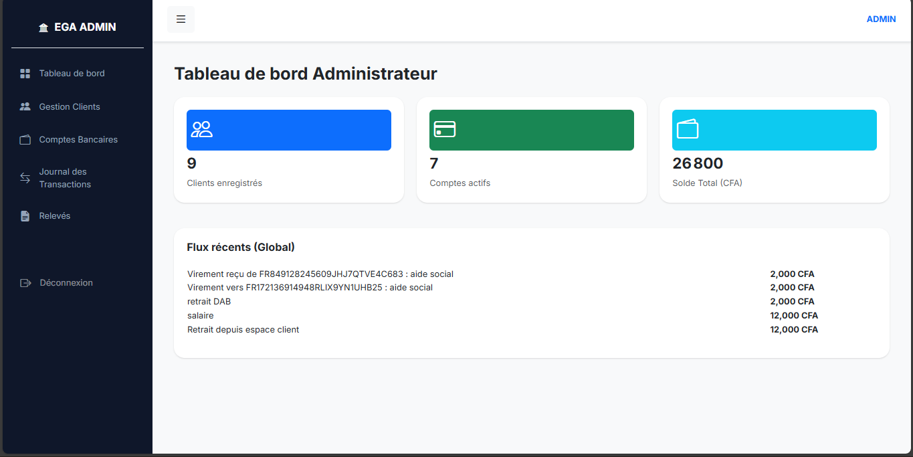
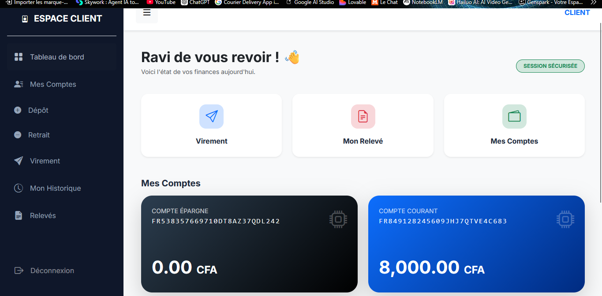
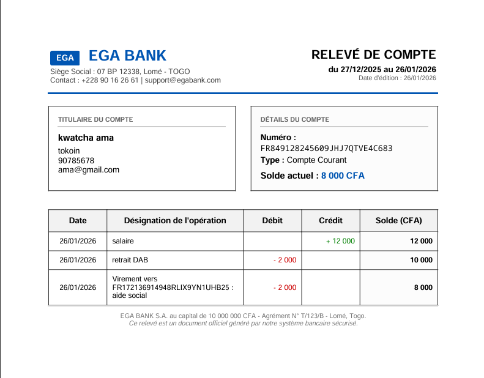
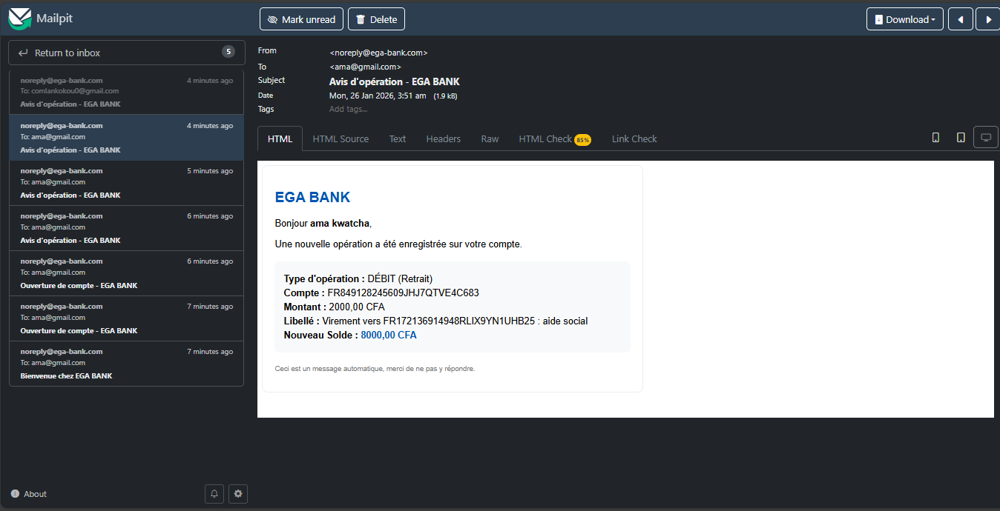

# 🏦 EGA BANK - Système de Gestion Bancaire Modern Fullstack

EGA BANK est une plateforme bancaire complète conçue pour offrir une expérience fluide aux administrateurs et une interface "Fintech" moderne aux clients. Le projet repose sur une architecture découplée, sécurisée et hautement performante.

<p align="center">
  
</p>

---

## ✨ Points Forts de l'Expertise
- **Architecture Pro :** Backend Spring Boot 4.0.1 & Frontend Angular 18+.
- **Sécurité Avancée :** Authentification Stateless via **JWT** avec gestion des rôles (RBAC).
- **Intégrité Financière :** Utilisation de l'annotation `@Transactional` pour garantir l'atomicité des virements.
- **Traçabilité :** Audit complet des soldes (`soldeApres`) pour chaque opération.

---

## 📸 Aperçu de l'Application

| Espace Administrateur | Espace Client Personnel |
|---|---|
|  |  |
| *Statistiques globales & Gestion Clients* | *Look Fintech & Actions Rapides* |

| Relevé Officiel (PDF) | Notification Email |
|---|---|
|  |  |
| *Génération binaire via iText & Thymeleaf* | *Avis d'opération asynchrone (@Async)* |

---

## 🛠️ Stack Technique

- **Backend :** Java 25, Spring Boot, Spring Security, Hibernate/JPA.
- **Frontend :** Angular 18, Bootstrap 5, SweetAlert2.
- **Base de données :** MySQL.
- **Outils :** Mailpit (SMTP), iText 7, Thymeleaf, Postman, Swagger.

---

## 🚀 Guide d'Installation (A à Z)

### 1. Configuration de la Base de Données (MySQL)
Exécutez le script suivant dans votre instance MySQL pour initialiser l'utilisateur et la base :
```sql
CREATE DATABASE IF NOT EXISTS ega_bank_db;
CREATE USER 'inf'@'localhost' IDENTIFIED BY 'ck11;1b*';
GRANT ALL PRIVILEGES ON ega_bank_db.* TO 'inf'@'localhost';
FLUSH PRIVILEGES;

2. Lancement du Serveur de Mail (Mailpit)

Le projet utilise Mailpit pour capturer les emails en local.
Allez dans le dossier /tools.
Ouvrez un terminal et lancez : mailpit.exe.
Consultez les mails sur : http://localhost:8025.

3. Démarrage du Backend (Java)
Ouvrez le projet dans votre IDE (IntelliJ/Eclipse).
mvn clean install
Lancez EbankBackendApplication.java.
Identifiants par défaut : admin@ega.com / admin123

4. Démarrage du Frontend (Angular)
Ouvrez un terminal dans le dossier ebank-frontend.
npm install
ng serve
Accès : http://localhost:4200

Tests & Documentation API

Swagger UI : Consultez la documentation interactive sur http://localhost:8080/swagger-ui/index.html.
Postman : Une collection complète avec scripts d'automatisation est disponible dans le dossier /TESTS_POSTMAN. Importez la collection pour tester les flux Versement, Retrait et Virement.

🛡️ Logique de Sécurité Bancaire

Hachage BCrypt : Aucun mot de passe n'est stocké en clair.
Suppression Logique (Soft Delete) : Les clients inactifs sont désactivés (active=false) pour préserver l'historique légal des transactions.
Gestion des Exceptions : Un GlobalExceptionHandler intercepte les erreurs (ex: Solde insuffisant) pour renvoyer des messages métier clairs à l'utilisateur.
Développé par Vinsmoke Walker
